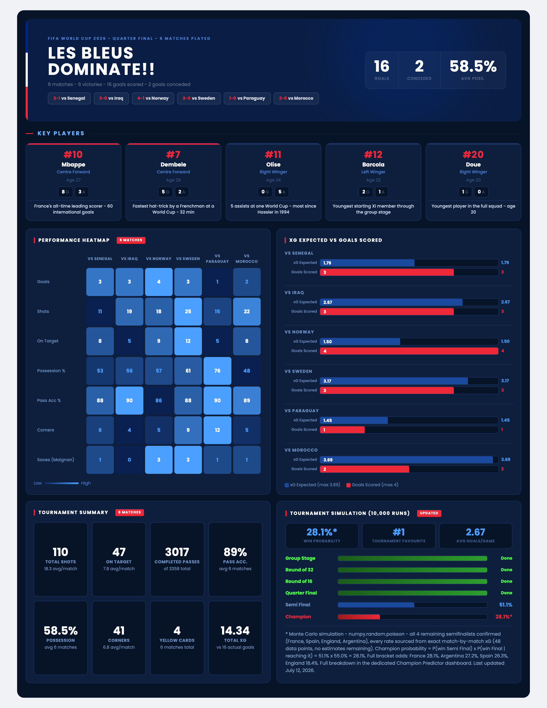
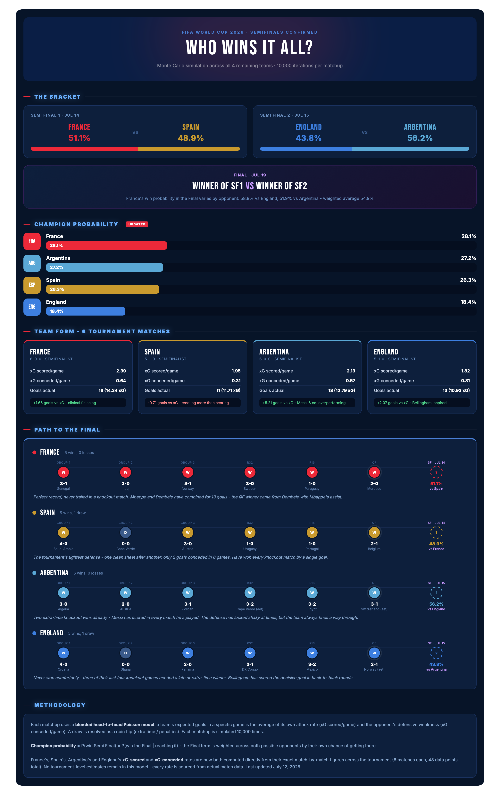

France WC 2026 (Data Analytics Dashboard)

A live-updated data analytics project tracking France's performance at the **FIFA World Cup 2026**, built as a portfolio project combining Python data analysis with fully custom HTML dashboards rendered inside Jupyter Notebook.


  What's inside?

- **Match statistics** - goals, shots, possession, passing accuracy, corners, saves;
- **xG analysis** - expected goals vs actual goals scored per match;
- **Performance heatmap** - colour-coded matrix of 7 key metrics across all matches;
- **Player contributions** - goals and assists for key players;
- **Monte Carlo tournament simulation** - 10,000 iterations using `numpy.random.poisson`, with a full head-to-head model built entirely from match-by-match xG data (no tournament-level estimates) for all 4 remaining semifinalists;
- **Champion Predictor dashboard** - a dedicated bracket-wide view: semifinal odds, a "Path to the Final" timeline for all 4 teams, and the full Champion probability breakdown;
- **Custom HTML dashboards** - fully designed and rendered inside Jupyter Notebook using `IPython.display`;


  Files

| File | Description |
|---|---|
| `france_analysis.ipynb` | Main Jupyter Notebook — full analysis pipeline and both dashboards |
| `dashboard.html` | Standalone HTML version of France's match-by-match dashboard |
| `champion_predictor.html` | Standalone HTML version of the tournament-wide Champion Predictor |
| `fff_crest.jpg` | FFF badge used as visual asset in the hero section |
| `README.md` | Project documentation |




  Current status

**Quarter Final complete - 6 matches, 6 victories**

| Match | Result | xG | xG conceded |
|---|---|---|---|
| vs Senegal | 3-1 | 1.79 | 0.53 |
| vs Iraq | 3-0 | 2.67 | 0.63 |
| vs Norway | 4-1 | 1.50 | 1.70 |
| vs Sweden | 3-0 | 3.24 | 0.70 |
| vs Paraguay | 1-0 | 1.45 | 0.13 |
| vs Morocco | 2-0 | 3.69 | 0.14 |

**Key stats:** 16 goals scored - 2 conceded - 58.5% avg possession - 89% pass accuracy - 14.34 total xG


  Champion Predictor - all 4 semifinalists confirmed



Every rate below is computed directly from exact match-by-match xG (48 data points across the 4 teams - no tournament-level estimates remain):

| Team | xG scored/game | xG conceded/game | Semi Final | Champion probability |
|---|---|---|---|---|
| **France** | 2.39 | 0.64 | vs Spain: **51.1%** | **28.1%** |
| **Spain** | 1.95 | 0.31 | vs France: 48.9% | 26.3% |
| **Argentina** | 2.13 | 0.57 | vs England: **56.2%** | 27.2% |
| **England** | 1.82 | 0.81 | vs Argentina: 43.8% | 18.4% |

France remain the narrow favourites, but with all four teams' defenses now precisely measured, this is a genuine three-way race at the top (France/Argentina/Spain are within 2 points of each other) - not the near-lock the early "average opponent" model (71.1%) implied.

Full breakdown, per-match xG, and the "Path to the Final" for each team: see `champion_predictor.html`.


  Key players

| Player | Position | Goals | Assists | Notable |
|---|---|---|---|---|
| Mbappé | Centre Forward | 8 | 3 | France all-time top scorer - 60 goals; assisted Dembélé's goal vs Morocco |
| Dembélé | Centre Forward | 5 | 2 | Fastest WC hat-trick by a Frenchman - 32 min; scored the QF opener vs Morocco |
| Olise | Right Winger | 0 | 5 | Most assists at a single WC since Häßler 1994 |
| Barcola | Left Winger | 2 | 1 | Youngest starter in the group stage |
| Doué | Right Winger | 1 | 0 | Youngest player in the squad |


  Tools & libraries

```
Python · pandas · numpy · matplotlib · seaborn · IPython.display · HTML/CSS
```


  Last updated

**July 12, 2026** - after all 4 semifinalists were confirmed (France, Spain, Argentina, England)

*Dashboard updated after every France match throughout the tournament.*

---

*Built by Zhanet Georgieva - Data Science student; have fun!* 
