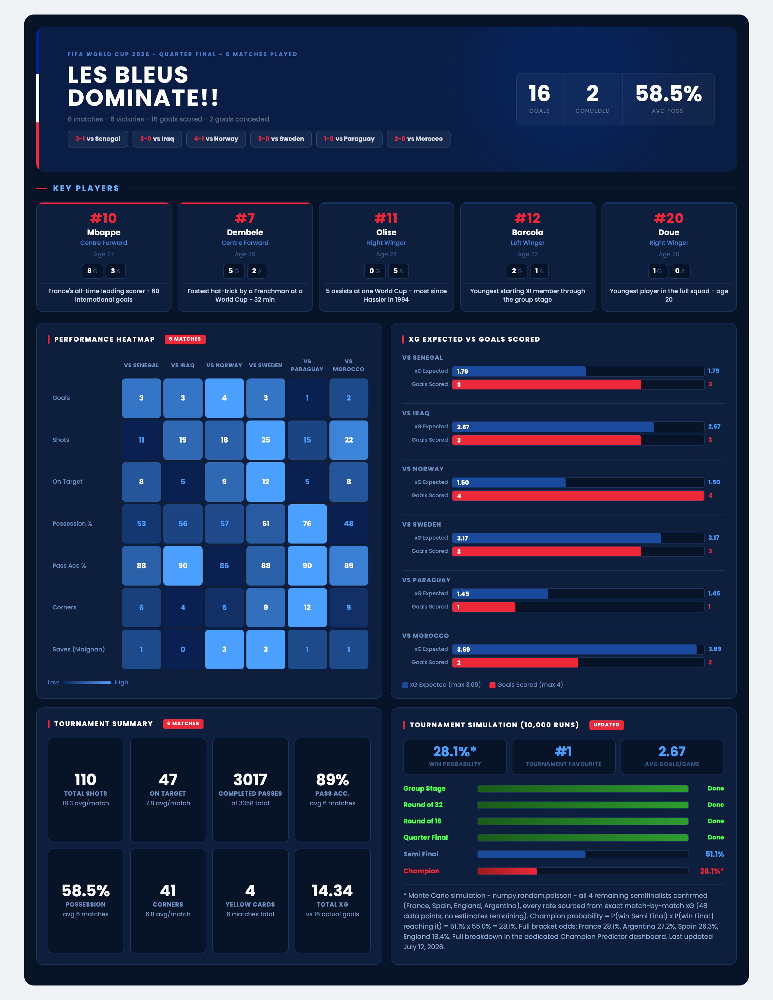
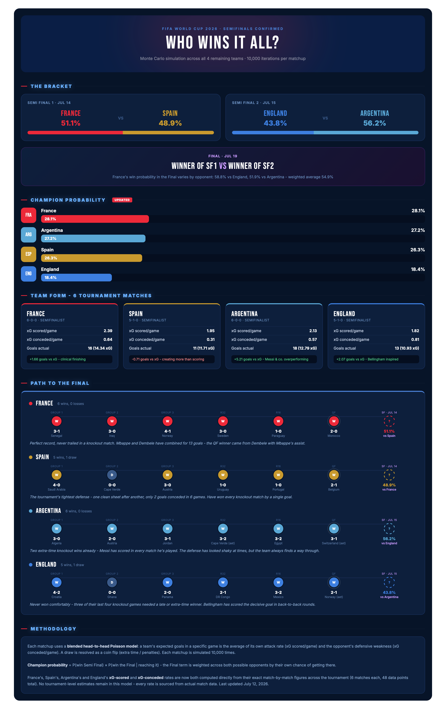
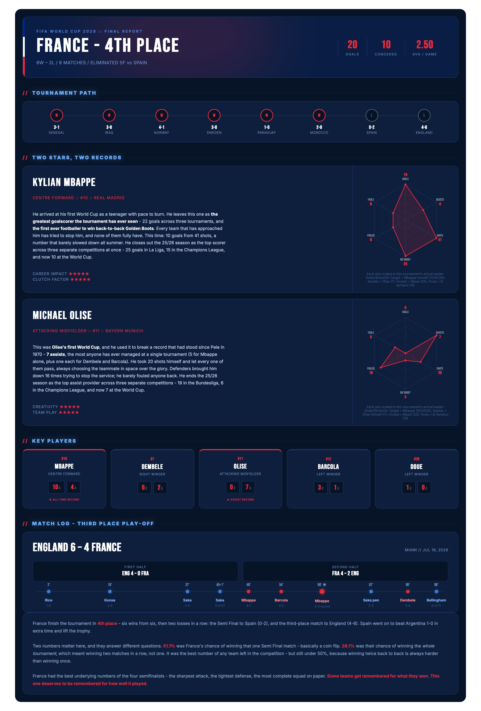

France WC 2026 (Data Analytics Dashboard)

A data analytics project tracking France's full run at the **FIFA World Cup 2026**, from the group stage through their eventual 4th-place finish - built as a portfolio project combining Python data analysis with fully custom HTML dashboards rendered inside Jupyter Notebook.


  What's inside?

- **Match statistics** - goals, shots, possession, passing accuracy, corners, saves;
- **xG analysis** - expected goals vs actual goals scored per match;
- **Performance heatmap** - colour-coded matrix of 7 key metrics across all matches;
- **Player contributions** - goals and assists for key players;
- **Monte Carlo tournament simulation** - 10,000 iterations using `numpy.random.poisson`, with a full head-to-head model built entirely from match-by-match xG data (no tournament-level estimates) for all 4 remaining semifinalists;
- **Champion Predictor dashboard** - a dedicated bracket-wide view: semifinal odds, a "Path to the Final" timeline for all 4 teams, and the full Champion probability breakdown;
- **Final Recap dashboard** - the full campaign story: every result, the two individual World Cup records broken along the way, and a breakdown of the wild 6-4 third-place match;
- **Custom HTML dashboards** - fully designed and rendered inside Jupyter Notebook using `IPython.display`;


  Files

| File | Description |
|---|---|
| `france_analysis.ipynb` | Main Jupyter Notebook - full analysis pipeline and dashboards |
| `dashboard.html` | Standalone HTML version of France's match-by-match dashboard |
| `champion_predictor.html` | Standalone HTML version of the tournament-wide Champion Predictor |
| `final_recap.html` | Full campaign recap - final result, records broken, third-place match breakdown |
| `fff_crest.jpg` | FFF badge used as visual asset in the hero section |
| `README.md` | Project documentation |






  Final result

**France finish 4th - 6 wins, 2 losses in 8 matches**

| Match | Result |
|---|---|
| vs Senegal | 3-1 |
| vs Iraq | 3-0 |
| vs Norway | 4-1 |
| vs Sweden | 3-0 |
| vs Paraguay | 1-0 |
| vs Morocco | 2-0 |
| **Semi Final** vs Spain | 0-2 |
| **3rd Place** vs England | 4-6 |

Spain, who beat France in the Semi Final, went on to win the tournament outright - 1-0 over Argentina in extra time. The model gave France 51.1% to win that Semi Final: essentially a coin flip that landed the other way, not a wrong prediction. Of the four semifinalists, France's underlying numbers (attack, defense, finishing) were the most complete top to bottom.


  Two records broken

- **Kylian Mbappe** - the all-time top scorer in World Cup history (22 goals across three tournaments), and the first ever footballer to win back-to-back Golden Boots (2022, 2026). Closes the 25/26 season as the top scorer across three competitions at once: 25 in La Liga, 15 in the Champions League, 10 at the World Cup.
- **Michael Olise** - broke the single-tournament assist record (7), previously held by Pele since 1970 - in his first ever World Cup, without scoring a single goal himself. Ends the season as the top assist provider across three competitions: 19 in the Bundesliga, 6 in the Champions League, 7 at the World Cup.


  The third-place match

England beat France 6-4 in Miami - the most goals scored in a World Cup match since 1982. England led 4-0 at half-time; France won the second half 4-2. Mbappe's 66th-minute goal was the one that made him the all-time World Cup scoring record holder.


  Tools & libraries

```
Python · pandas · numpy · matplotlib · seaborn · IPython.display · HTML/CSS
```


  Last updated

**July 26, 2026** - full tournament complete, including the Final (Spain 1-0 Argentina, aet)

---

*Built by Zhanet Georgieva - Data Science student; have fun!* 
